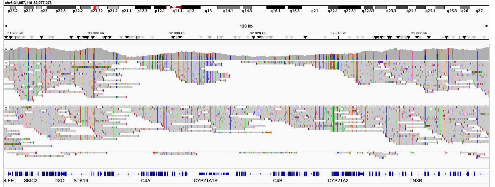
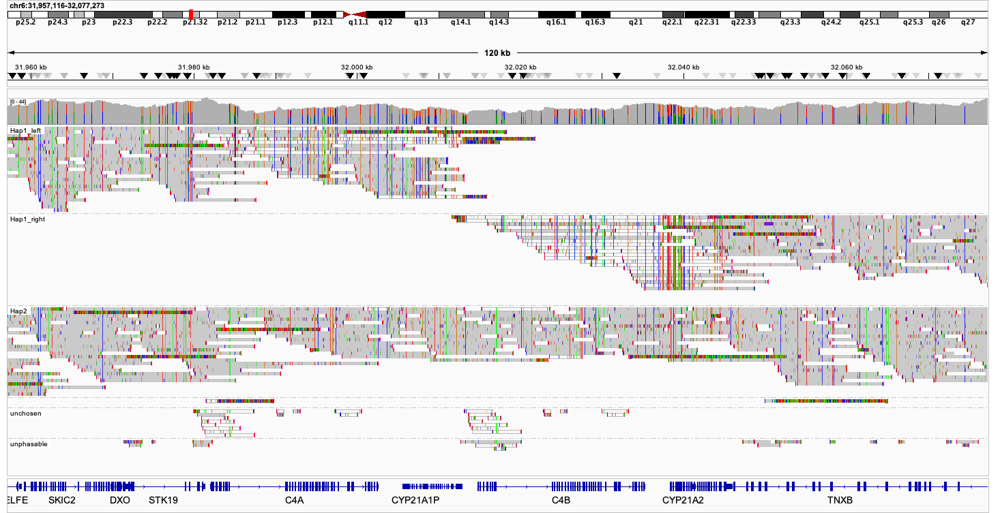
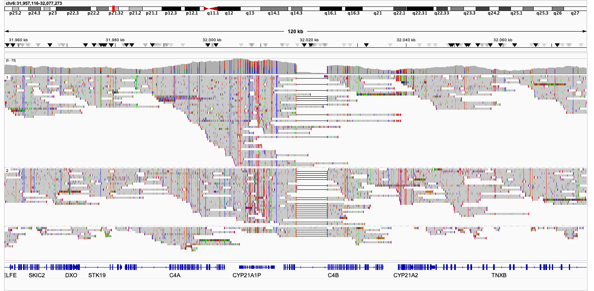
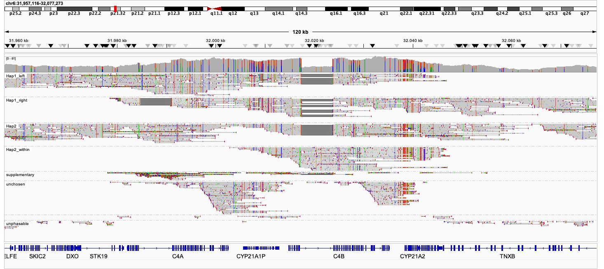
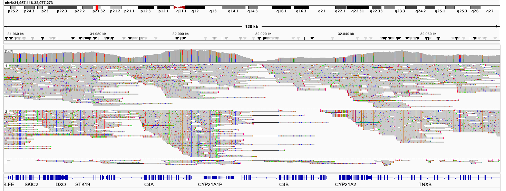
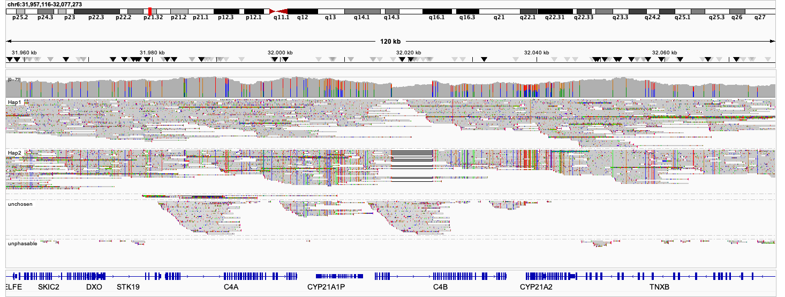

# Interpretation of results

In this tutorial, it is our goal to aid clinitians in how they can interpret the results produced by NanoCAH.

## The output files

After you have performed the preperatory steps, like producing the unfiltered alignment file, and have run this alignment through the NanoCAH software; you should have produced the following files;

* A filtered and phased alignment file(_NanoCAH_filtered_alignment_sorted.bam)
* An assortment of aligned assemblies (_asm_Hap1_sorted.bam, _asm_Hap2_sorted.bam, asm_all_sorted.bam)
* A variant file containing small variants (_SNV.vcf.gz)
* A variant file containing larger variants (_SV.vcf.gz)

The variant files can be run through software like VarSeq to extrapolate relevant pathogenic variants.

## Interpretation of the structure

In most commonly used human reference sequences, like hg38 or T2T-chm13 there is one copy of the active CYP21A2 and one copy of the inactive pseudogene CYP21A1P. Unfortunately, as is explained in the introduction, high genomic instability of the region can cause many types of structural variants. To get a better understanding of the structural variants of the two haplotypes for a particular sample the alignment files should be evaluated using IGV. 

In this following section we will show you real-world examples of results obtained from clinically diagnosed CAH patients, showing outputs from NanoCAH and comparing them to the results obtained using the classical method of simple alignment filtering and phasing.

#### A deletion

In the case of a large deletion in one or more of the haplotypes, you will see a gap in coverage.

When evaluating the alignment results obtained without NanoCAH, you see this aforementioned gap in coverage. If variants are called on this type of alignment, you can often run into problems where pathogenic variants are not called due to low coverage.

#### An insertion

#### A chimera

