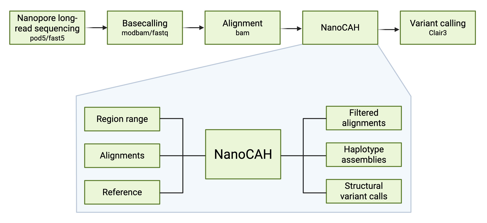

# NanoCAH
NanoCAH is a local re-phaser, built to deal with difficult-to-phase regions with segmental duplications using Oxford Nanopore long-read DNA sequencing data.

... image ...

** Table of contents måske ***

### Introduction

This software was developed to resolve the notoriously difficult gene region around *CYP21A2*, in which pathogenic variants cause congenital adrenal hyperplasia (CAH). The *CYP21A2* gene is difficult to resolve due to the homologous pseudogene *CYP21A1P* located just upstream of the active *CYP21A2* gene. The close proximity and high homology between the two often make read mapping to the region ambiguous. Additionally, high genomic instability in the area results in large insertions, deletions, and the formation of chimeric genes. All these factors lead to variant calls from this region often being unreliable using standard tools. To solve this problem, we run basecalled and aligned Oxford Nanopore long-read DNA sequencing data through the NanoCAH algorithm before variant calling. By employing this specialized bioinformatic algorithm, it is possible to accurately distinguish between reads that map to the active CYP21A2 gene and the reads that map to the pseudogene, determine the presence of large deletion, insertions or chimeric genes, and accurately phase reads, thereby making variant calling in the region much more reliable.


### How to get started




```bash
conda create -n NanoCAH -c bioconda -c pysam conda-forge minimap2 levenshtein samtools 

conda activate NanoCAH
```

```bash
minimap2 -ax map-ont -Y {reference} -t {thread_count} {basecall_infile} | samtools view -bS | samtools sort > {alignment_outfile}

samtools index -@ {thread_count} {alignment_outfile}
```

```bash
python NanoCAH.py -i {alignment_file} -o {bam_outfile_prefix}.bam -r {reference} -s {span} -a {asm_outfile_prefix}.fasta {extra_flags}
```

** mangler **

### The input data

Although NanoCAH was developed using Oxford Nanopore long-read sequencing data, it should be compatible with any long-read sequencing method, including PacBio.


### The algorithm

The following is a more technical description of how the NanoCAH algorithm works.


The required input parameters:

* infile - A bam file containing the ufiltered alignments
* reference - The reference used for alignment
* bed or range - A bed file containing the ranges to be evaluated or a single range in the following format CHROM:START-END (bed not implemented yet)

Relevant parameters mention in the algorithm description:

* minimum_count - The minimum representation count for a position to remain usable. (DEFAULT: 3)
* minimum_overlap - The minimal identical overlap between blocks or between a read and a block, used for low variance merging. (DEFAULT: 3)

* maximum_diff - The maximal count difference, used for merging blocks. (DEFAULT: 8)
* minimum_depth - The minimum read count at a particular position, used for block splitting. (DEFAULT: 3)
* minimum_coverage - The minimum read count in one block, used in read selection. (DEFAULT: 5)

* max_iterations - Implemented to prevent infinite while loops. (DEFAULT: 5)
* max_variance - The maximal allowed variance in a usable SNP. Is used to remove SNPs that are heterozygotic due to being located in an error-prone region. (DEFAULT: 0.5)
* minimum_identity - The minimum required identity to merge two blocks with high confidence SNPs. Used in final merging. (DEFAULT: 0.9)
* minimum_pct_overlap - The minimal identical percentage overlap between blocks or between read and block, used for final merging. (DEFAULT: 0.5)

##### Creating data dictionaries

First, all reads are loaded into a read dictionary. The read dictionary contains base information for all positions with variable base composition. A variant dictionary is created containing information from each position.

The variant dictionary is then filtered for low coverage SNPs. This means; if a base is found in less than the minimum count reads, then the base is removed from the variant dictionary for that position. If the position then only contains reads with matched bases, then the position is deemed unusable and is removed from the variant dictionary. Only read information included in the variant dictionary is considered in the subsequent grouping.

Each read is then added to a haploblock dictionary, which groups the reads into blocks. If a read overlaps with at least one block with the minimum overlap, then the read is added to the block with most reads. If a read overlaps with no existing blocks, then a new block is created. 
If a read contains no usable variants, it is classed as unphasable. In this way all phasable reads are grouped into a block.  

Because a read that contain less variants than the minimum overlap will never overlap with an existing block; a round of no variance merging is performed, where these one-read blocks are added to the largest block with an overlapping identity of 100%. 

##### Performing low variance merging

Once all phasable reads have been grouped to a block; the blocks are merged with increasing variance, iterating from zero count difference to the maximal count difference.

For example, if two blocks have an identical overlap above the minimum overlap, but are mismatched at 3 positions, then possible merging of the two blocks is evaluated. Each of the mismatched positions are evaluated to check if at least one of the blocks has a depth below the minimum count. If one or more of these 3 mismatched positions have a depth larger than the minimum count in both blocks, then the position is defined as a high confidence SNP, thereby preventing the two blocks from being merged. If all 3 positions have at least one block with a depth less than the minimum count, then the two blocks are merged. For each mismatched position; the reads from the block with the lowest depth are temperarily removed. If the temperary removal causes the base count for a variant position to fall below the minimum count, then the base and possibly the position is removed from the variant dictionary. Through these iterations of merging blocks, carefully allowing more and more variation, we remove uninformative variants.

Rounds of ambiguous block cleanups move reads that map to more than one block to the block with the highest coverage. Each block is then split, if two neighboring positions are covered by less than the minimum depth common reads. After block splitting, the blocks are merged again. This causes necessary shuffling in regions with low variant counts, thereby removing additional uninformative positions.

In the final merging, blocks are again split, if two neighboring positions are covered by less than the minimum depth common reads, and subsequently merged if each subblock only has one possible pairing. This prevents the case where a block could theoretically be merged with more than one block, thereby possibly causing a bad merging.

In the end you should have blocks limited to reads with 100% identity with that given block. Reads that do not group due to high SNP count or group to multiple blocks are deemed ambigous, and are therefore intitally excluded from the next step of read selection.

##### Read selection

After low variance merging, each block should only contain reads that uniquely map to that given block. Now we utilize the fact that some reads map more than once to select the best mapping and identify blocks which are connected as an insertion, deletion or chimera. This is done by evaluating each block and determining if the secondary reads should be kept or removed. Here there are 2 scenarios;

* Keeping both the primary and secondary reads with multiple mapping will cause another block's coverage to fall below the minimum coverage, and therefore that other block should be removed. 

* Two blocks have more than the minimum coverage reads in common and is therefore likely connected by a large deletion or insertion.

In the case that it is impossible to know which mapping is the correct one, all read alignments will be classified as unchosen.

After read selection there should only be one remaining alignment for each read, except in cases of large structural variants or reads that are classed as unchosen. 

##### Assemble haplotypes

The last step is stitching blocks together to make the haplotypes. If two blocks come from the same haplotype that contain a large deletion or insertion, then there will be a left and right grouping of that haplotype. After the final haplotype assembly, a consensus sequence is made for each haplotype. In the case of a deletion or insertion, the two sides are compared to find the optimal overlap.

##### Things to consider

In cases of complete homozygozity, a consensus sequence will be made and named "unphasable". It is still possible to remove read mappings in the cases of multimapping, but if there is a deletion in a completely homozygotic region, the software will not be able to correctly stitch the two sides, which will cause the consensus sequence to have an unintended duplication. Although this is true, it still improves the ability to call variants for the sample.

### FAQ

As this algorithm is new and specialized to data available to me, I'm willing to assist with any problems that may arise when the algorithm meets new data. I am also open to any suggestions for improvements.


### The author (As of Febuary 2025) 

I, Laura Skak, am a recent graduate of bioinformatics from Aarhus University and now work as a PhD student at MOMA in Aarhus, Denmark working on exploring the epigenetics of individuals with sex chromosome aneuploidies.